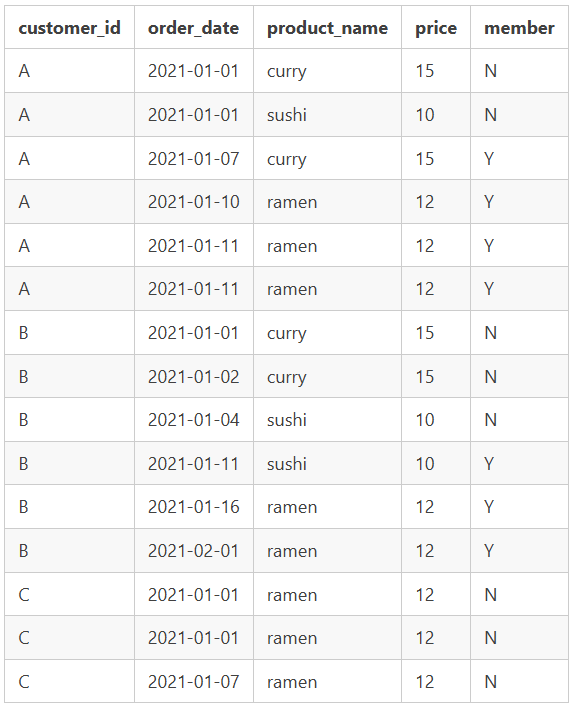

# Case Study #1 - Danny's Diner
## Overview
All information related to this case study can be found at [Case Study #1 - Danny's Diner](https://8weeksqlchallenge.com/case-study-1/).

All solutions used PostgreSQL v17.

## Questions and Answers
### 1. What is the total amount each customer spent at the restaurant?
______________________________________________________________________

**Overview:**

Tables Used:

| Table | Why |
| ----- | --- |
| sales | Contains the information of what each customer bought |
| menu  | Contains the price of each bought item |

Expected Results:
- Customer A spent $76
- Customer B spent $74
- Customer C spent $36

I solved this by:
1. Using a join to connect the two tables (I chose left join but inner join would work as well).
2. Using SUM to add up the prices of the bought items.
3. Grouping the above by customer_id.

**SQL Statement:**
	
```sql	
SELECT
s.customer_id AS "Customer"
,SUM(m.price) AS "Total Spent"

FROM dannys_diner.sales AS s
LEFT JOIN dannys_diner.menu AS m ON m.product_id = s.product_id

GROUP BY s.customer_id

ORDER BY s.customer_id
```

**Table Output:**

| Customer | Total Spent |
| -------- | ----------- |
| A        | 76          |
| B        | 74          |
| C        | 36          |

**Answer:**

- Customer A spent $76
- Customer B spent $74
- Customer C spent $36

### 2. How many days has each customer visited the restaurant?
______________________________________________________________

**Overview:**

Tables Used:

| Table | Why |
| ----- | --- |
| sales | Contains both the customer and the order date data |

Expected Results:
- Customer A visited 4 times
- Customer B visited 6 times
- Customer C visited 2 times

I solved this by:
1. Using a COUNT DISTINCT on the order_date column (NOTE: You cannot just use COUNT as there are multiple sales on the same day).
2. Grouping the above by customer_id.

**SQL Statement:**

```sql
SELECT
s.customer_id AS "Customer"
,COUNT(DISTINCT s.order_date) AS "Num of Visits"

FROM dannys_diner.sales AS s

GROUP BY s.customer_id

ORDER BY s.customer_id
```

**Table Output:**

| Customer | Num of Visits |
| -------- | ------------- |
| A        | 4             |
| B        | 6             |
| C        | 2             |

**Answer:**

- Customer A has visited 4 times
- Customer B has visited 6 times
- Customer C has visited 2 times

### 3. What was the first item from the menu purchased by each customer?
________________________________________________________________________
**Overview**

Tables used:

| Table | Why |
| ----- | --- |
| sales | Contains the customer_id, order_date, and product_id needed for ranking. |
| menu  | Contains the product_name. |

Expected Results:
- Customer A first bought both sushi and curry
- Customer B first bought curry
- Customer C first bought 2 ramens

So, I solved this by:
1. Using the window function RANK with PARTITION BY on the customer_id while setting ORDER BY order_date.
2. Taking the above query and using it as a subquery.
3. Only showing the data where "Rank" is 1.

**SQL Statement**

```sql
SELECT
"Customer"
,"Product"

FROM (SELECT
	s.customer_id AS "Customer"
	,s.order_date AS "Order Date"
	,m.product_name AS "Product"
	,RANK() OVER(PARTITION BY s.customer_id ORDER BY s.order_date ASC) AS "Rank"

	FROM dannys_diner.sales AS s
	LEFT JOIN dannys_diner.menu AS m ON m.product_id = s.product_id
) AS ranked_product

WHERE
"Rank" = 1
```

**Table Output*

| Customer | Product |
| -------- | ------- |
| A        | curry   |
| A        | sushi   |
| B        | curry   |
| C        | ramen   |
| C        | ramen   |

**Answer**

- Customer A first bought curry and sushi
- Customer B first bought curry
- Customer C first bought ramen

### 4. What is the most purchased item on the menu and how many times was it purchased by all customers?
________________________________________________________________________________________________________
**Overview**

Tables Used:

| Table | Why |
| ----- | --- |
| sales | Contains each product ordered by each customer |
| menu  | Contains the name of each product |

Expected Results:
- 8 ramens

I solved this by:
1. Using COUNT to count the number of product_id's ordered.
2. Grouping the count by the Product.
3. Limiting to 1 so only the top product will show.

**SQL Statement**

```sql
SELECT
COUNT(s.product_id) AS "Product Count"
,m.product_name AS "Product"

FROM dannys_diner.sales AS s
LEFT JOIN dannys_diner.menu AS m ON m.product_id = s.product_id

GROUP BY "Product"
LIMIT 1
```

**Table Output**

| Product Count | Product |
| ------------- | ------- |
| 8             | ramen   |

**Answer**

The most purchased item on the menu is ramen with a total of 8 being purchased across all customers.

### 5. Which item was the most popular for each customer?
______________________________________________________________

**Overview**

Tables Used:
| Table | Why |
| ----- | --- |
| sales | Contains the customer and what they purchased. |
| menu  | Contains the product name. |

Expected Results:
- Customer A bought ramen the most
- Customer B bought curry, ramen, and sushi the most (all three were bought an equal number of times)
- Customer C bought ramen the most

I solved this by:
1. I used COUNT on product_id to figure out the number of products each customer ordered.
2. I used the window function RANK to PARTITION BY customer_id and ORDER BY the above COUNT
3. Took the above and used it as a subquery.
4. Used the WHERE clause to show only what was ranked as 1.

**SQL Statement**
```sql
SELECT
"Customer"
,"Product"

FROM(SELECT
	s.customer_id AS "Customer"
	,m.product_name AS "Product"
	,COUNT(s.product_id) AS "Product Count"
	,RANK() OVER(PARTITION BY s.customer_id ORDER BY COUNT(s.product_id) DESC) AS "Rank"

	FROM dannys_diner.sales AS s
	LEFT JOIN dannys_diner.menu AS m ON m.product_id = s.product_id

	GROUP BY "Customer", "Product"
) AS ranked_product

WHERE
"Rank" = 1
```
**Table Output**

| Name 1 | Name 2 |
| ------ | ------ |
| A      | ramen  |
| B      | ramen  |
| B      | curry  |
| B      | sushi  |
| C      | ramen  |

**Answer**

- Customer A ordered ramen the most
- Customer B ordered all three (ramen, sushi, and curry) equally the most
- Customer C ordered ramen the most

### 6. Which item was purchased first by the customer after they became a member?
_________________________________________________________________________________

**Overview**

Tables Used:

| Table | Why |
| ----- | --- |
| sales | Contains the products ordered by each customer |
| menu  | Contains the name of each product |
| members | Contains when each member joined as a member |

Expected Results:
- Customer A ordered ramen
- Customer B ordered sushi
- Customer C isn't a member and won't show up in the list

I solved this by:
1. Joining the sales and members tables on two different criteria to weed out any customers or order dates we didn't want to look at.
2. Using RANK with PARTITION BY customer_id ORDER BY order_date to get a ranking of each product ordered.
3. Turning the above query into a Common Table Expression (CTE).
4. Querying the CTE for where rank is 1 after joining the table to the menu table to get the product name.

NOTE: Customer A became a member on the same day they purchased something. Since it's unclear if they purchased became a member first that day and then purchased something or if they purchased something and then became a memember, I decided to exclude that day from the query.

**SQL Statement**
```sql
WITH ranked_products AS (SELECT
	s.customer_id AS "Customer"
	,s.order_date AS "Order Date"
	,s.product_id AS "Product ID"
	,RANK() OVER(PARTITION BY s.customer_id ORDER BY s.order_date ASC) AS "Rank"

	FROM dannys_diner.sales AS s
	INNER JOIN dannys_diner.members AS mb ON s.customer_id = mb.customer_id AND s.order_date > mb.join_date)

SELECT
"Customer"
,m.product_name AS "Product Name"

FROM ranked_products AS rp
LEFT JOIN dannys_diner.menu AS m ON rp."Product ID" = m.product_id

WHERE
"Rank" = 1

ORDER BY "Customer" ASC
```

**Table Output**

| Customer | Product Name |
| -------- | ------------ |
| A        | ramen        |
| B        | sushi        |

**Answer**

- Customer A ordered ramen after becoming a member
- Customer B ordered sushi after becoming a member


### 7. Which item was purchased just before the customer became a member?
_________________________________________________________________________

**Overview**

Tables Used:

| Table | Why |
| ----- | --- |
| sales | Contains the products ordered by each customer |
| menu  | Contains the name of each product |
| members | Contains when each member joined as a member |

Expected Results:
- Customer A ordered sushi and curry (same day)
- Customer B ordered sushi
- Customer C isn't a member and won't show up in the list

I solved this by:
1. Joining the sales and members tables on two different criteria to weed out any customers or order dates we didn't want to look at.
2. Using RANK with PARTITION BY customer_id ORDER BY order_date DESC to get a ranking of each product ordered.
3. Turning the above query into a Common Table Expression (CTE).
4. Querying the CTE for where rank is 1 after joining the table to the menu table to get the product name.

NOTE: Customer A became a member on the same day they purchased something. Since it's unclear if they purchased became a member first that day and then purchased something or if they purchased something and then became a memember, I decided to exclude that day from the query.

**SQL Statement**

```sql
WITH ranked_products AS (SELECT
	s.customer_id AS "Customer"
	,s.order_date AS "Order Date"
	,s.product_id AS "Product ID"
	,RANK() OVER(PARTITION BY s.customer_id ORDER BY s.order_date DESC) AS "Rank"

	FROM dannys_diner.sales AS s
	INNER JOIN dannys_diner.members AS mb ON s.customer_id = mb.customer_id AND s.order_date < mb.join_date)

SELECT
"Customer"
,m.product_name AS "Product Name"

FROM ranked_products AS rp
LEFT JOIN dannys_diner.menu AS m ON rp."Product ID" = m.product_id

WHERE
"Rank" = 1

ORDER BY "Customer" ASC
```

**Table Output**

| Customer | Product Name |
| -------- | ------------ |
| A        | sushi        |
| A        | curry        |
| B        | sushi        |

**Answer**

- Customer A ordered both sushi and curry before becoming a member
- Customer B ordered sushi before becoming a member

### 8. What is the total items and amount spent for each member before they became a member?
____________________________________________________________________________________________

**Overview**

Tables Used:

| Table | Why |
| ----- | --- |
| sales | Contains the products ordered by each customer |
| menu  | Contains the name of each product |
| members | Contains when each member joined as a member |

Expected Results:
- Customer A bought 2 items at $25
- Customer B bought 3 items at $40
- Customer C isn't a member and won't show up in this list

I solved this by:
1. Joining all three tables together
2. Using COUNT on product_id to count the number of products bought
3. Using SUM on price to determine total amount spent
4. Grouping the above by customer_id

**SQL Statement**
```sql
SELECT
s.customer_id AS "Customer"
,COUNT(s.product_id) AS "Product Count"
,SUM(m.price) AS "Total Sales"

FROM dannys_diner.sales AS s
INNER JOIN dannys_diner.members AS mb ON s.customer_id = mb.customer_id AND s.order_date < mb.join_date
LEFT JOIN dannys_diner.menu AS m ON m.product_id = s.product_id

GROUP BY "Customer"

ORDER BY "Customer" ASC
```
**Table Output**

| Customer | Product Count | Total Sales |
| -------- | ------------- | ----------- |
| A        | 2             | 25          |
| B        | 3             | 40          |

**Answer**

- Customer A bought 2 items at $25
- Customer B bought 3 items at $40

### 9. If each $1 spent equates to 10 points and sushi has a 2x points multiplier - how many points would each customer have?
_____________________________________________________________________________________________________________________________

**Overview**

Tables Used:

| Table | Why |
| ----- | --- |
| sales | Contains the products ordered by each customer |
| menu  | Contains the product name and prices of each product |

Expected Results:
- Customer A will have 860pts
- Customer B will have 940pts
- Customer C will have 360pts

I solved this by:
1. Joining the two tables together with a LEFT JOIN
2. Using CASE to create a Points column based on the product_name
3. Turning the above query into a Common Table Expression (CTE) 
4. Querying the CTE and using SUM to add all the points up
5. Grouping the above by Customer

**SQL Statement**

```sql
WITH pts_tbl AS (SELECT
    s.customer_id AS "Customer"
	,s.product_id AS "Product ID"
	,m.price AS "Price"
	,CASE
		WHEN m.product_name = 'sushi' THEN 20 * m.price
    	ELSE 10 * m.price
	END AS "Points"

	FROM dannys_diner.sales AS s
	LEFT JOIN dannys_diner.menu AS m ON s.product_id = m.product_id
)

SELECT
"Customer"
,SUM("Points") AS "Points Total"

FROM pts_tbl

GROUP BY "Customer"

ORDER BY "Customer" ASC
```
**Table Output**

| Customer | Points Total |
| -------- | ------------ |
| A        | 860          |
| B        | 940          |
| C        | 360          |

**Answer**

- Customer A has 860 points
- Customer B has 940 points
- Customer C has 360 points

### 10. In the first week after a customer joins the program (including their join date) they earn 2x points on all items, not just sushi - how many points do customer A and B have at the end of January?
__________________________________________________________________________________________________________________________

**Overview**

Tables Used:

| Table | Why |
| ----- | --- |
| sales | Contains the products ordered by each customer |
| menu  | Contains the name of each product |
| members | Contains when each member joined as a member |

Expected Results:
- Customer A should have 1370 pts
- Customer B should have 940 pts
- Customer C isn't a member and won't show up in this list

I solved this by:
1. Joining all 3 tables together. I used an INNER JOIN for the 'sales' and 'members' table so only values in both tables would show (meaning it would exclude C since they are not a customer). Then a LEFT JOIN to join the menu table.
2. Using a CASE statement, I added a condition where any product named 'sushi' or any date within 7 after joining provided a 20 point multiplyer
3. Taking the above query and turning it in a Common Table Expression (CTE) for easy querying.
4. Using SUM to add all the points together from the CTE.
5. Using a WHERE statement to indicate I only want the points from January.

**SQL Statement**
```sql
WITH pts_tbl AS (SELECT
	s.customer_id AS "Customer"
	,s.order_date AS "Order Date"
	,CASE
		WHEN m.product_name = 'sushi' OR (s.order_date >= mb.join_date AND s.order_date <= mb.join_date + INTERVAL '7 days') THEN 20 * m.price
   		ELSE 10 * m.price
	END AS "Points"

	FROM dannys_diner.sales AS s
	INNER JOIN dannys_diner.members as mb ON s.customer_id = mb.customer_id
	LEFT JOIN dannys_diner.menu AS m ON s.product_id = m.product_id

	ORDER BY "Customer", "Order Date"
)

SELECT
"Customer"
,SUM("Points") AS "Points Total"

FROM pts_tbl

WHERE
EXTRACT(month from "Order Date") < 2

GROUP BY "Customer"
```
**Table Output**

| Customer | Points Total |
| -------- | ------------ |
| A        | 1370         |
| B        | 940          |

**Answer**
- Customer A has 1370 pts for January
- Customer B has 940 pts for January

### Bonus Question 1 - Join All The Things
__________________________________________

**Overview**

Tables Used:

| Table | Why |
| ----- | --- |
| sales | Contains the products ordered by each customer |
| menu  | Contains the name of each product |
| members | Contains when each member joined as a member |
 
Expected Output:


I solved this by:
1. Joining all 3 tables together. I used LEFT JOINs because I wanted to showcase every customer from the sales table.
2. Using a CASE statement to indicate when a customer is a memember.
3. Using ORDER BY to order the results by customer_id, order_date, and product_name.

**SQL Statement**
```sql
SELECT
s.customer_id
,s.order_date
,m.product_name
,m.price
,CASE
	WHEN s.order_date >= mb.join_date THEN 'Y'
    ELSE 'N'
END AS "member"

FROM dannys_diner.sales AS s
LEFT JOIN dannys_diner.menu AS m ON s.product_id = m.product_id
LEFT JOIN dannys_diner.members AS mb ON s.customer_id = mb.customer_id

ORDER BY s.customer_id ASC, s.order_date ASC, m.product_name ASC
```