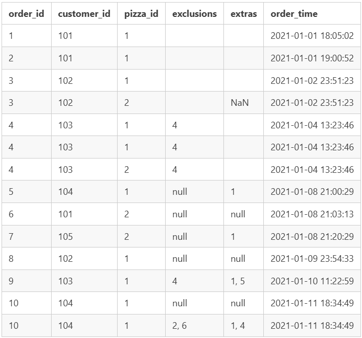

# Case Study #2 - Pizza Runner
## Overview
All information related to this case study can be found at [Case Study #2 - Pizza Runner](https://8weeksqlchallenge.com/case-study-2/).

All solutions used PostgreSQL v17.

## Data Cleanup
Two tables - `customer_orders` and `runner_orders` - contain `NULL` and `NaN` values that need to be cleaned up.

### customer_orders Cleanup
___________________________

**Original Table**

The `exclusions` and `extras` columns both need to be cleaned up.


I cleaned the table by:
1. Using a `CASE` statement on the `exlusions` column by indicating that any value that is unwanted (i.e. `null` or `''`) should be replaced with `NULL`.
2. Using a `CASE` statement on the `extras` columns by indicating that any value that is unwanted (i.e. `null` or `''`) should be replaced with `NULL`.

NOTE: I thought about using `COALESCE` but the `null` values don't count as actual NULLs but are actually just text saying null.

**SQL Statement**

```sql
WITH customer_orders_clean AS (SELECT
	co.order_id
	,co.customer_id
	,co.pizza_id
	,CASE
		WHEN co.exclusions = 'null' OR co.exclusions = '' THEN NULL
   	 	ELSE co.exclusions
	END AS exclusions
	,CASE
		WHEN co.extras = 'null' OR co.extras = '' THEN NULL
    	ELSE co.extras
	END AS extras
	,co.order_time

	FROM pizza_runner.customer_orders AS co
)

SELECT *

FROM customer_orders_clean
```

**Cleaned Table**

| order_id | customer_id | pizza_id | exclusions | extras | order_time          |
| -------- | ----------- | -------- | ---------- | ------ | ------------------- |
| 1        | 101         | 1        |            |        | 2020-01-01 18:05:02 |
| 2        | 101         | 1        |            |        | 2020-01-01 19:00:52 |
| 3        | 102         | 1        |            |        | 2020-01-02 23:51:23 |
| 3        | 102         | 2        |            |        | 2020-01-02 23:51:23 |
| 4        | 103         | 1        | 4          |        | 2020-01-04 13:23:46 |
| 4        | 103         | 1        | 4          |        | 2020-01-04 13:23:46 |
| 4        | 103         | 2        | 4          |        | 2020-01-04 13:23:46 |
| 5        | 104         | 1        |            | 1      | 2020-01-08 21:00:29 |
| 6        | 101         | 2        |            |        | 2020-01-08 21:03:13 |
| 7        | 105         | 2        |            | 1      | 2020-01-08 21:20:29 |
| 8        | 102         | 1        |            |        | 2020-01-09 23:54:33 |
| 9        | 103         | 1        | 4          | 1, 5   | 2020-01-10 11:22:59 |
| 10       | 104         | 1        |            |        | 2020-01-11 18:34:49 |
| 10       | 104         | 1        | 2, 6       | 1, 4   | 2020-01-11 18:34:49 |

### runner_orders Cleanup
__________________________

**Original Table**

The `pickup_time`, `distance`, `duration`, and `cancellation` columns both need to be cleaned up.


I cleaned the table by:
1. Using a `CASE` statement on the `pickup_time` column by indicating that any value that is unwanted (i.e. `null` or `''`) should be replaced with `NULL`. Then I converted the right values to `TIMESTAMP`.
2. Using a `CASE` statement on the `distance` column by indicating that any value that is unwanted (i.e. `null` or `''`) should be replaced with `NULL` OR using `TRIM` to remove `km` from the value. Then I converted all the right values to `DECIMAL`.
3. Using a `CASE` statement on the `duration` column by indicating that any value that is unwanted (i.e. `null` or `''`) should be replaced with `NULL` OR using `TRIM` to remove `minutes`, `minute`, `mins`, or `min` from the value. Then I converted all the right values to `INT`.
4. Using a `CASE` statement on the `cancellation` column by indicating that any value that is unwanted (i.e. `null` or `''`) should be replaced with `NULL`.

NOTE: I thought about using `COALESCE` but the `null` values don't count as actual NULLs but are actually just text saying null.

**SQL Statement**

```sql
WITH runner_orders_clean AS (SELECT
  ro.order_id
  ,ro.runner_id
  ,CASE
      WHEN ro.pickup_time = 'null' OR ro.pickup_time = '' THEN NULL
      ELSE ro.pickup_time::TIMESTAMP
  END AS pickup_time
  ,CASE
      WHEN ro.distance = 'null' OR ro.distance = '' THEN NULL
      WHEN ro.distance LIKE '%km' THEN TRIM('km' FROM ro.distance)::DECIMAL
      ELSE ro.distance::DECIMAL
  END AS distance
  ,CASE
      WHEN ro.duration = 'null' OR ro.duration = '' THEN NULL
      WHEN ro.duration LIKE '%minutes' THEN TRIM('minutes' FROM ro.duration)::INT
      WHEN ro.duration LIKE '%minute' THEN TRIM('minute' FROM ro.duration)::INT
      WHEN ro.duration LIKE '%mins' THEN TRIM ('mins' FROM ro.duration)::INT
      WHEN ro.duration LIKE '%min' THEN TRIM ('min' FROM ro.duration)::INT
      ELSE ro.duration::INT
  END AS duration
  ,CASE
      WHEN ro.cancellation = 'null' OR ro.cancellation = '' THEN NULL
      ELSE ro.cancellation
  END AS cancellation

  FROM pizza_runner.runner_orders AS ro
)

SELECT *

FROM runner_orders_clean
```

**Cleaned Table**

| order_id | runner_id | pickup_time         | distance | duration | cancellation            |
| -------- | --------- | ------------------- | -------- | -------- | ----------------------- |
| 1        | 1         | 2020-01-01 18:15:34 | 20       | 32       |                         |
| 2        | 1         | 2020-01-01 19:10:54 | 20       | 27       |                         |
| 3        | 1         | 2020-01-03 00:12:37 | 13.4     | 20       |                         |
| 4        | 2         | 2020-01-04 13:53:03 | 23.4     | 40       |                         |
| 5        | 3         | 2020-01-08 21:10:57 | 10       | 15       |                         |
| 6        | 3         |                     |          |          | Restaurant Cancellation |
| 7        | 2         | 2020-01-08 21:30:45 | 25       | 25       |                         |
| 8        | 2         | 2020-01-10 00:15:02 | 23.4     | 15       |                         |
| 9        | 2         |                     |          |          | Customer Cancellation   |
| 10       | 1         | 2020-01-11 18:50:20 | 10       | 10       |                         |


## Questions and Answers
### A. Pizza Metrics
____________________
All questions and solutions for Pizza Metrics can be found in the [Pizza Metrics](A_PizzaMetrics.md) file.

### B. Runner and Customer Experience
_____________________________________
All questions and solutions for Runner and Customer Experience can be found in the [Runner and Customer Experience](B_RunnerandCustomerExperience.md) file.

### C. Ingredient Optimization
______________________________
All questions and solutions for Ingredient Optimization can be found in the [Ingredient Optimization](C_IngredientOptimization.md) file.

### D. Pricing and Ratings
__________________________
All questions and solutions for Pricing and Ratings can be found in the [Pricing and Ratings](D_PricingandRatings.md) file.

### E. Bonus Questions
______________________
All questions and solutions for Bonus Questions can be found in the [Bonus Questions](E_BonusQuestions.md) file.


