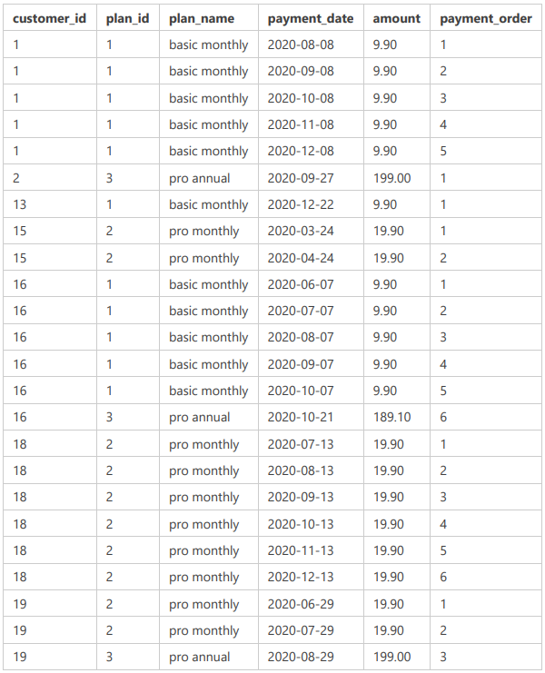

# Challenge Payment Question

> NOTE: Thank you to [Partha Sarathi](https://github.com/ParthaSarathi-raw/8WeekSQLChallenge-Solutions/tree/main/Week%20-%203%20-%20Foodie-Fi#challenge-payment-solution) for help on this question. I was completely lost without their explanation.

## Questions and Answers
### The Foodie-Fi team wants you to create a new payments table for the year 2020 that includes amounts paid by each customer in the subscriptions table with the following requirements:
___________________________________________________________________________________________________________________________
**Requirements**

- monthly payments always occur on the same day of month as the original start_date of any monthly paid plan
- upgrades from basic to monthly or pro plans are reduced by the current paid amount in that month and start immediately
- upgrades from pro monthly to pro annual are paid at the end of the current billing period and also starts at the end of the month period
- once a customer churns they will no longer make payments

**Overview:**

Tables Used:

| Table | Why |
| ----- | --- |
| customer_info_plans | Contains information on the customer and each plan they have |

Expected Results:



**SQL Statement:**
	
```sql
WITH customer_info_plans AS (SELECT
  s.customer_id
  ,s.plan_id
  ,p.plan_name
  ,p.price
  ,s.start_date

  FROM foodie_fi.subscriptions AS s
  LEFT JOIN foodie_fi.plans AS p ON s.plan_id = p.plan_id
                             
  ORDER BY s.customer_id, s.start_date
),
cip_cutoff_date AS (SELECT
cip.*
/* Use the LEAD window function to figure out if there is a cutoff date when someone changes their
plan. If they change plans, the cutoff_date is populated. If not, it is left as null. This will
come in handy when we generate our end dates for the payments table. */
,LEAD(cip.start_date) OVER(PARTITION BY cip.customer_id ORDER BY cip.start_date) AS cutoff_date

FROM customer_info_plans AS cip

/* We only want to look at the year 2020 and we don't care about trial plans (since they're
free). */
WHERE
EXTRACT(YEAR FROM cip.start_date) = 2020 AND
cip.plan_name != 'trial'
),
payment_table_temp AS (SELECT
  *
  FROM (SELECT
    cd.customer_id
    ,cd.plan_id
    ,cd.plan_name
    /* Generate a series of dates in 1 month intervals that starts at the start_date and
    ends with either the cutoff_date OR 2020-12-31 (depending on which comes first). */
    ,GENERATE_SERIES(
      cd.start_date,
      /* Grab which date comes first. If cutoff_date is null, then the end date will be
      2020-12-31. If cutoff_date is NOT null, then use cutoff_date. */
      COALESCE(cd.cutoff_date - 1, '2020-12-31'::date),
      '1 month'::interval
    ) AS payment_date
    ,cd.price AS amount

    FROM cip_cutoff_date AS cd

    /* We don't want to generate a series of dates for anything that is churn or
    pro annual. */
    WHERE
    cd.plan_name != 'churn' AND
    cd.plan_name != 'pro annual'

    /* Join the below query, which does look at pro annual plans, to the above query, which
    doesn't look at pro annual plans. This way we aren't generating a montlhy series for
    pro annual plans. */
    UNION ALL

    SELECT
    cip.customer_id
    ,cip.plan_id
    ,cip.plan_name
    ,cip.start_date AS payment_date
    ,cip.price AS amount

    FROM customer_info_plans AS cip

    /* Only look at pro annual plans. */
    WHERE
    cip.plan_name = 'pro annual'
  ) AS pt

  ORDER BY pt.customer_id, pt.payment_date
),
payment_table_full AS (SELECT
  pt_temp.customer_id
  ,pt_temp.plan_id
  ,pt_temp.plan_name
  ,pt_temp.payment_date
  /* Determine when to subtract off the 9.90 from the pro monthly or pro annual plans. */
  ,CASE
      WHEN (
        /* IF the previous plan_name is basic monthly */
        LAG(pt_temp.plan_name) OVER(PARTITION BY pt_temp.customer_id ORDER BY pt_temp.payment_date) = 'basic monthly'
        /* AND the current plan is either a pro monthly or pro annual plan */
        AND pt_temp.plan_name IN ('pro monthly','pro annual')
        /* AND the previous payment_date + 1 month is greater than the current payment_date, meaning
        the plan was upgraded in the middle of the billing cycle */
        AND LAG(pt_temp.payment_date) OVER(PARTITION BY pt_temp.customer_id ORDER BY pt_temp.payment_date) + '1 month'::interval > pt_temp.payment_date
      /* THEN take the current amount and subtract off the basic monthly rate of 9.90 */
      ) THEN pt_temp.amount - 9.90
      /* Otherwise, leave the amount alone */
      ELSE pt_temp.amount
  END AS amount

  FROM payment_table_temp AS pt_temp
)

SELECT
ptf.*
/* Use the ROW_NUMBER window function to label each row with a payment_order number grouped
by the customer_id and ordered by the payment_date. */
,ROW_NUMBER() OVER(PARTITION BY ptf.customer_id ORDER BY ptf.payment_date) AS payment_order

FROM payment_table_full AS ptf

WHERE
ptf.customer_id IN (1, 2, 13, 15, 16, 18, 19)
```

**Table Output:**

| customer_id | plan_id | plan_name     | payment_date           | amount | payment_order |
| ----------- | ------- | ------------- | ---------------------- | ------ | ------------- |
| 1           | 1       | basic monthly | 2020-08-08 00:00:00+00 | 9.90   | 1             |
| 1           | 1       | basic monthly | 2020-09-08 00:00:00+00 | 9.90   | 2             |
| 1           | 1       | basic monthly | 2020-10-08 00:00:00+00 | 9.90   | 3             |
| 1           | 1       | basic monthly | 2020-11-08 00:00:00+00 | 9.90   | 4             |
| 1           | 1       | basic monthly | 2020-12-08 00:00:00+00 | 9.90   | 5             |
| 2           | 3       | pro annual    | 2020-09-27 00:00:00+00 | 199.00 | 1             |
| 13          | 1       | basic monthly | 2020-12-22 00:00:00+00 | 9.90   | 1             |
| 15          | 2       | pro monthly   | 2020-03-24 00:00:00+00 | 19.90  | 1             |
| 15          | 2       | pro monthly   | 2020-04-24 00:00:00+00 | 19.90  | 2             |
| 16          | 1       | basic monthly | 2020-06-07 00:00:00+00 | 9.90   | 1             |
| 16          | 1       | basic monthly | 2020-07-07 00:00:00+00 | 9.90   | 2             |
| 16          | 1       | basic monthly | 2020-08-07 00:00:00+00 | 9.90   | 3             |
| 16          | 1       | basic monthly | 2020-09-07 00:00:00+00 | 9.90   | 4             |
| 16          | 1       | basic monthly | 2020-10-07 00:00:00+00 | 9.90   | 5             |
| 16          | 3       | pro annual    | 2020-10-21 00:00:00+00 | 189.10 | 6             |
| 18          | 2       | pro monthly   | 2020-07-13 00:00:00+00 | 19.90  | 1             |
| 18          | 2       | pro monthly   | 2020-08-13 00:00:00+00 | 19.90  | 2             |
| 18          | 2       | pro monthly   | 2020-09-13 00:00:00+00 | 19.90  | 3             |
| 18          | 2       | pro monthly   | 2020-10-13 00:00:00+00 | 19.90  | 4             |
| 18          | 2       | pro monthly   | 2020-11-13 00:00:00+00 | 19.90  | 5             |
| 18          | 2       | pro monthly   | 2020-12-13 00:00:00+00 | 19.90  | 6             |
| 19          | 2       | pro monthly   | 2020-06-29 00:00:00+00 | 19.90  | 1             |
| 19          | 2       | pro monthly   | 2020-07-29 00:00:00+00 | 19.90  | 2             |
| 19          | 3       | pro annual    | 2020-08-29 00:00:00+00 | 199.00 | 3             |

**Answer:**

- See table above.