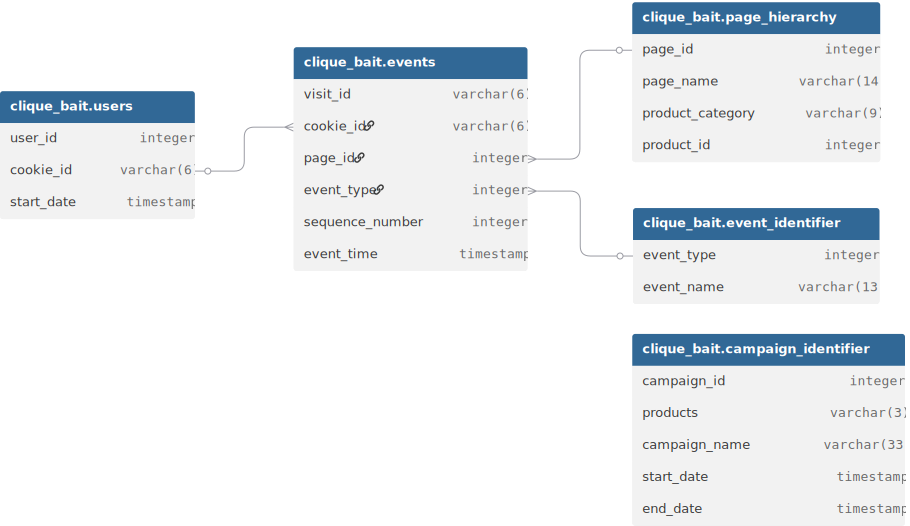

# Enterprise Relationship Diagram (ERD)
## Table of Contents

[Enterprise Relationship Diagram](#enterprise-relationship-diagram)

## Enterprise Relationship Diagram Image
___________________________________________________________________________________________________________________________


## Enterprise Relationship Diagram Code
___________________________________________________________________________________________________________________________
Here is the code I used to develop the ERD in dbdiagram.io

```sql
Table clique_bait.event_identifier {
  event_type integer
  event_name varchar(13)
}

Table clique_bait.campaign_identifier {
  campaign_id integer
  products varchar(3)
  campaign_name varchar(33)
  start_date timestamp
  end_date timestamp
}

Table clique_bait.page_hierarchy {
  page_id integer
  page_name varchar(14)
  product_category varchar(9)
  product_id integer
}

Table clique_bait.users {
  user_id integer
  cookie_id varchar(6)
  start_date timestamp
}

Table clique_bait.events {
  visit_id varchar(6)
  cookie_id varchar(6)
  page_id integer
  event_type integer
  sequence_number integer
  event_time timestamp
}


Ref: "clique_bait"."users"."cookie_id" < "clique_bait"."events"."cookie_id"

Ref: "clique_bait"."events"."page_id" > "clique_bait"."page_hierarchy"."page_id"

Ref: "clique_bait"."events"."event_type" > "clique_bait"."event_identifier"."event_type"
```